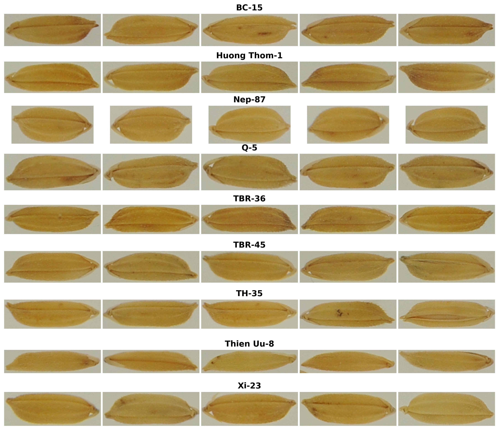
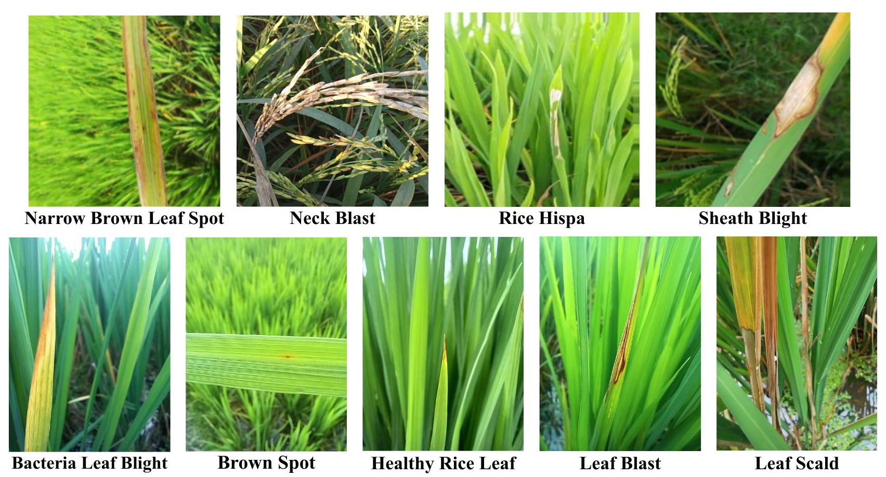
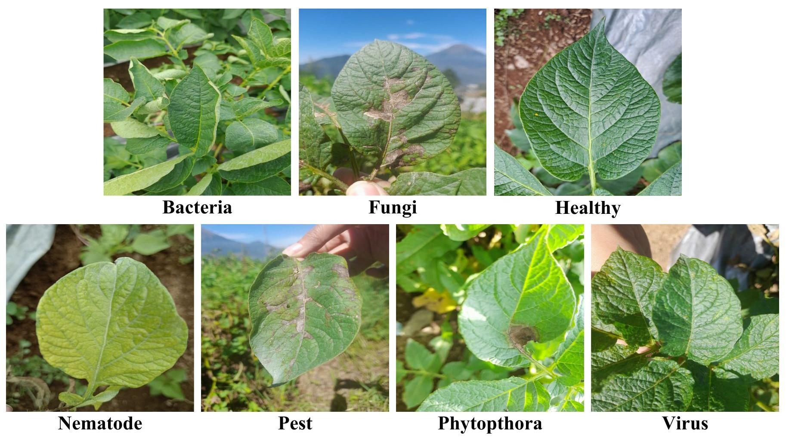
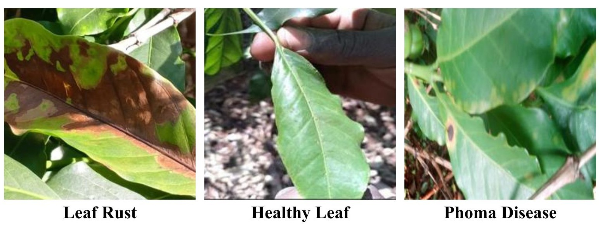
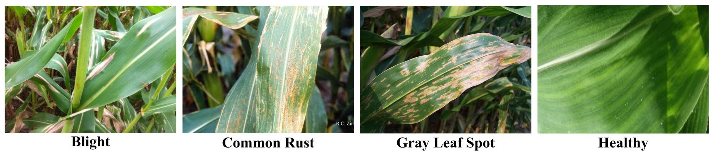

## Data description

In this study, we use a total of five different datasets to evaluate the effectiveness of the proposed method. The primary dataset is a rice variety dataset that we have constructed and introduced. The remaining four datasets focus on leaf diseases in rice, coffee, corn, and potato. These datasets are employed to demonstrate the generalization capability and potential applicability of the model across different image recognition tasks.

### Rice variety dataset

This study employs an image dataset comprising nine Vietnamese rice seed varieties, including BC-15, Huong Thom-1, Nep-87, Q-5, TBR-36, TBR-45, TH-35, Thien Uu-8, and Xi-23. Several of these varieties exhibit highly similar visual appearances in terms of seed shape, size, surface texture, and color. The discriminative morphological cues among varieties are often subtle and difficult to perceive without specialized expertise, which poses significant challenges for automated recognition. Figure 1 illustrates representative samples of the rice seed varieties.

To reflect practical seed inspection and purity verification scenarios, the dataset is organized following a one-versus-rest binary classification scheme, consistent with experimental settings adopted in previous studies on seed purity assessment. For each rice variety, images of that variety are treated as positive samples representing authentic seeds, while images from the remaining eight varieties are collectively regarded as negative samples corresponding to contaminated or non-pure seeds. This formulation decomposes the task into independent binary decisions, each aiming to determine whether a given seed belongs to the target variety or not.

To mitigate bias caused by class imbalance, the numbers of positive and negative samples are carefully controlled, with the difference between the two classes kept within a relatively small margin. Table 1 summarizes the distribution of images for each rice variety. For example, the Xi-23 subset contains 2,340 positive images of Xi-23 seeds, while its 2,239 negative samples are randomly selected from the other eight varieties. This experimental design closely mimics real-world inspection conditions, where the primary objective is to detect impurity rather than to identify all seed types.

*Figure 1: Sample images from the rice variety dataset containing 9 different rice varieties.*

**Table 1: Description of 9 types of rice seed image dataset**

| Rice seed name | Positive | Negative | Total images |
| :--- | :---: | :---: | :---: |
| BC-15 | 1834 | 1925 | 3759 |
| Huong Thom-1 | 2116 | 2200 | 4316 |
| Nep-87 | 1399 | 1468 | 2867 |
| Q-5 | 1924 | 2020 | 3944 |
| TBR-36 | 1136 | 1192 | 2328 |
| TBR-45 | 1140 | 1197 | 2337 |
| TH-35 | 1012 | 1062 | 2074 |
| Thien Uu-8 | 1026 | 1077 | 2103 |
| Xi-23 | 2340 | 2239 | 4579 |

### Rice leaf disease dataset

This dataset ([Kaggle dataset](https://www.kaggle.com/datasets/loki4514/rice-leaf-diseases-detection)) is an enhanced collection of 11,790 labeled images of rice leaves, encompassing both healthy and diseased conditions. The dataset is provided in an augmented form by the authors, incorporating various transformations such as rotation, scaling, horizontal and vertical flipping, and color manipulation to increase sample diversity and robustness. This diversity supports effective model training for distinguishing visual patterns across different leaf states. It includes nine categories: *Leaf Blast* (1,748), *Sheath Blight* (1,629), *Brown Spot* (1,546), *Leaf Scald* (1,332), *Rice Hispa* (1,299), *Bacterial Leaf Blight* (1,197), *Healthy Rice Leaf* (1,085), *Neck Blast* (1,000), and *Narrow Brown Leaf Spot* (954). The dataset is split into 80%, 10%, and 10% for training, validation, and testing, respectively. Sample images illustrating these conditions are presented in Figure 2.

*Figure 2: Sample images from the rice leaf disease dataset showing various leaf diseases.*

### Potato leaf disease dataset

This dataset ([Mendeley dataset](https://data.mendeley.com/datasets/ptz377bwb8/1)) is a comprehensive collection of 3,076 labeled images of potato leaves, captured from farms in Central Java, Indonesia [[Shabrina2024](https://doi.org/10.1016/j.dib.2023.109955)]. The images belong to seven distinct classes: *Healthy* (201 images), *Bacteria* (569 images), *Fungi* (748 images), *Nematode* (68 images), *Pest* (611 images), *Phytophthora* (347 images), and *Virus* (532 images). All images are provided in `JPEG` format with a high resolution of $1500 \times 1500$ pixels. The dataset is partitioned into 81%, 9%, and 10% for training, validation, and testing, respectively, following the original study [[Shabrina2024](https://doi.org/10.1016/j.dib.2023.109955)]. Sample images illustrating these conditions are presented in Figure 3.

*Figure 3: Sample images from the potato leaf disease dataset showing different leaf diseases.*

### Coffee leaf disease dataset

This dataset ([Mendeley dataset](https://doi.org/10.17632/k36wnd6knb.1)) is a structured collection of 3,219 labeled images of coffee leaves, captured from farms in Uganda [[Chelangat2025](https://doi.org/10.17632/k36wnd6knb.1)]. The images belong to three distinct classes: *Healthy* (1,078 images), *Leaf Rust* (1,031 images), and *Phoma Disease* (1,110 images). All images are provided in `JPEG` format with a consistent resolution of $256 \times 256$ pixels. The dataset is divided into 64%, 16%, and 20% for training, validation, and testing, respectively. Sample images illustrating these conditions are presented in Figure 4.

*Figure 4: Sample images from the coffee leaf disease dataset illustrating different leaf diseases.*

### Corn leaf disease dataset

This dataset ([Mendeley dataset](https://doi.org/10.17632/tywbtsjrjv.1)) is a collection of 4,188 images sourced from the PlantVillage dataset, focusing on common corn leaf diseases [[ArunPandian2019](https://doi.org/10.17632/tywbtsjrjv.1)]. The images are categorized into four distinct classes: *Common Rust* (1,306 images), *Blight* (1,146 images), *Gray Leaf Spot* (574 images), and *Healthy* (1,162 images). The dataset is split into 64%, 16%, and 20% for training, validation, and testing, respectively. Sample images illustrating these conditions are presented in Figure 5.

*Figure 5: Sample images from the corn leaf disease dataset capturing various leaf disease patterns.*
